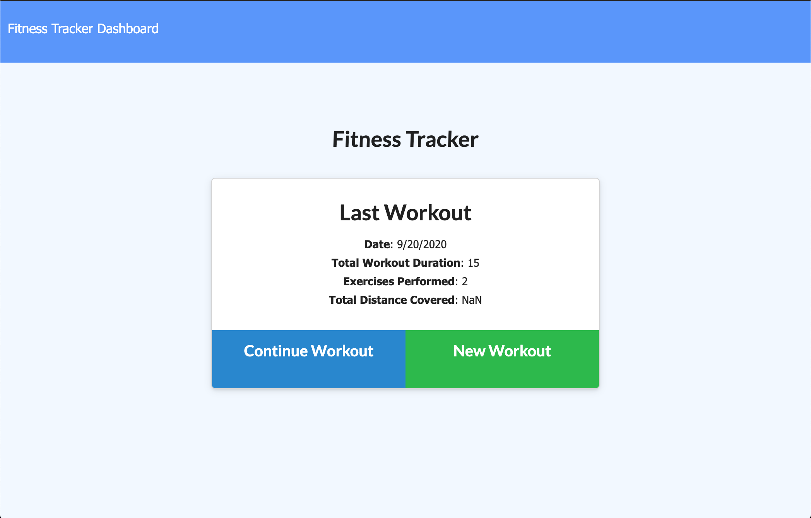
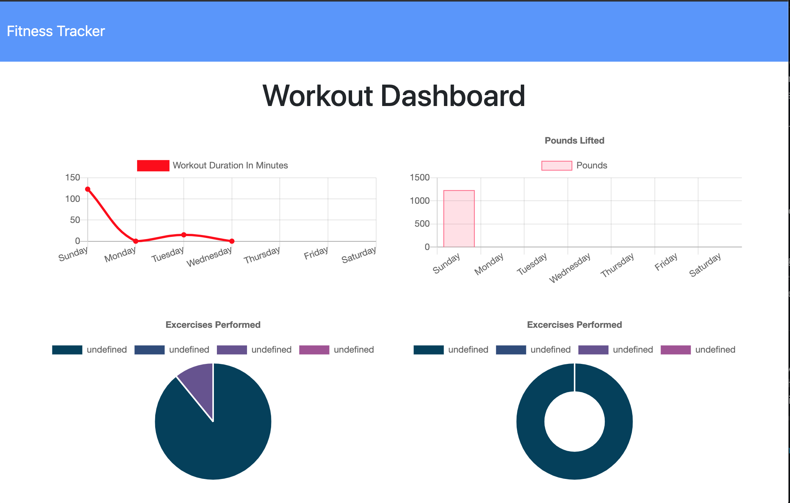

##  <h3 align = "center"> Fitness Tracker Pro! </h3>

                        
 ## Project Description 
      This application is used for tracking your fitness!  You can enter different work out routines, what type of workout, the amount of reps, and the duration of your work out to track your daily/weekly/monthly progress!  Get in shape and track your results!
                        
Link to deployed website:  https://git.heroku.com/rocky-lake-04533.git

 ## Table of Contents
* [Project Description](#project-description)
* [Installation Instructions](#installation-instructions)
* [Usage Information](#usage-information)
* [Contribution Guidelines](#contribution-guidelines)
* [Test Instructions](#test-instructions)
* [Questions](#questions)

    
 
## Licenses    
    This applicaiton is covered with:
    

    
    This application is used for tracking your fitness!  You can enter different work out routines, what type of workout, the amount of reps, and the duration of your work out to track your daily/weekly/monthly progress!  Get in shape and track your results!
                        
 ## Installation Instructions

    This is an online application so no need to install.
                        
 ## Usage Information
 
    N/A
                        
 ## Contribution Guidelines
 
    N/A
                        
 ## Test Instructions
 
    N/A
                        
 ## Questions
 
                        Feel free to contact me via Gifthub or by my e-mail!
Github Username:  rbraun04

 <a href = "https://github.com/rbraun04">GitHub</a> - Click to go to my profile!

 Email:  ryan@thelyricla.com

 [![LinkedIn][linkedin-shield]][linkedin-url]

[linkedin-shield]: https://img.shields.io/badge/-LinkedIn-black.svg?style=flat-square&logo=linkedin&colorB=555
[linkedin-url]: https://linkedin.com/in/ryangbraun
[Boost-shield]: https://img.shields.io/badge/License-Boost%201.0-lightblue.svg
[Boost-url]: https://www.boost.org/LICENSE_1_0.txt
                       